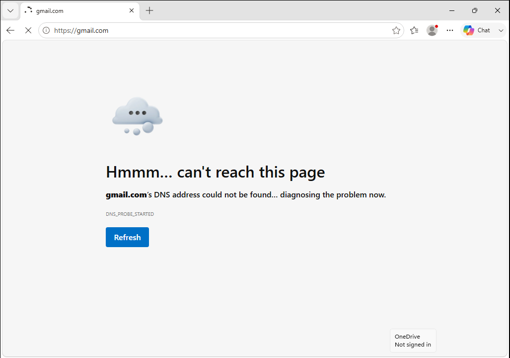
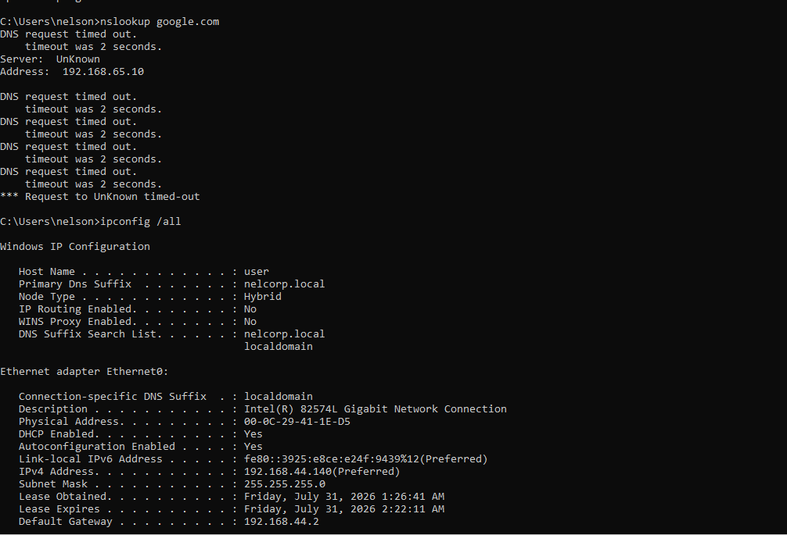
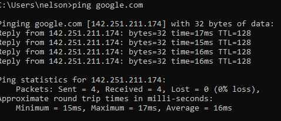

# Incident Report

##  DNS Misconfiguration Causing Internet Access Failure
**Incident #:**  01

**Date:** 5/25/2026 

**System/Device:** Windows 11 Pro Virtual Machine (Domain-Joined Client) 

**Severity:** Medium

---

# 1. Incident Summary

**Issue Reported:**

The user reported that they couldn't access websites from their workstation 

---

# 2. Symptoms

Symptoms observed:

- The workstation was unable to load any websites.
- The browser displayed the error: "<website>'s IP address could not be found."
- After failing to charge the website it would show an error "{website domain}'s IP Address could be not found"

---

# 3. Environment Details

**Operating System:** Windows 11 Pro 

**Device Type:** VMware Virtual Machine 

**Network Configuration:**  Connected to Active Directory environment

**Domain/Workgroup:** nelcorp.local


---

# 4. Initial Assessment

Initial checks performed::

- Verified that the Windows 11 client VM was powered on and connected to the network.
- Confirmed that the issue was only affecting this workstation.
- Checked the network adapter status and confirmed it was enabled.
- Tested network connectivity with the ping command.

---

# 5. Troubleshooting Steps

## Step 1: 

**Action Performed:**

Tested DNS name resolution by pinging google.com. and pinging 8.8.8.8 (Public Google DNS server)

**Command Used:**

```cmd
ping google.com
ping 8.8.8.8
```
**Result:**

When I used the ping command i couldn't communicate with google.com resulting in a 100% loss. However when pinging 8.8.8.8 an address and not a domain name we got a 0% loss.

**Finding:**
Since when pinging a domain name we aren't able to communicate with the website but when pinging an address directly we are this looks to be likely a DNS name resolution problem. 

## Step 2: 

**Action Performed:**

Reviewed the workstation's IP configuration to verify the IP address, default gateway, and DNS settings.

**Command Used:**

```cmd
ipconfig /all
```
**Result:**

All the workstation network configuration was correct except the DNS server IP which should've been 192.168.44.10 and instead was set to 192.168.65.10

**Finding:**

The problem might be a DNS server error rather than a connection error


## Step 3: 

**Action Performed:**

Ping the server IP (192.168.44.10) and the Google Public DNS ip (8.8.8.8)

**Command Used:**

```cmd
ping 192.168.44.10
ping 8.8.8.8
```
**Result:**

Both connectivity tests completed successfully.

**Finding:**

In fact the problem was the incorrect settings in the DNS server IP address.

## Step 4: 

**Action Performed:**

Updated Network configuration for the preferred DNS address to point to the server's address

**Tool Used:**

Network adapter properties window

**Result:**

The workstation was now able to communicate with the right DNS IP address 

## Step 5: 

**Action Performed:**

Tested that everything was working normally by accesing a website in the browser and pinging google.com again

**Tool Used:**

Internet Browser and command Prompt

**Command used:**

```cmd
ping google.com
```
**Result:**

Both tests were a success.

# 6. Root Cause

The workstation was configured with an incorrect Preferred DNS Server address. Because the client could not communicate with the Active Directory DNS server, it was unable to resolve domain names, preventing access to websites and other network resources.

# 7. Resolution

Steps performed:
- Corrected the Preferred DNS Server address.
- Verified the network adapter configuration.
- Confirmed successful DNS name resolution.
- Verified internet connectivity through both the web browser and Command Prompt.

# 8. Verification

Tests performed:
- Successfully resolved domain names using nslookup.

# 9. Screenshots / Evidence
## 1. Initial Issue
The user was unable to access websites due to a network connectivity issue.



---

## 2. Initial Investigation
Verified the workstation's network configuration and connectivity using Command Prompt.



---

## 3. Root Cause Evidence
Identified that the workstation was configured with an incorrect DNS server.


---

## 4. Resolution
Updated the DNS configuration to use the correct DNS server.


---

## 5. Browser Verification
Confirmed that websites loaded successfully after applying the fix.


---

## 6. Command-Line Verification
Verified successful DNS resolution and network connectivity using Command Prompt.



# 10. Lessons Learned

This incident reinforced the importance of verifying DNS configuration when troubleshooting network connectivity issues. It also demonstrated how a single incorrect DNS setting can prevent access to websites and Active Directory resources even when general network connectivity is functioning correctly.
