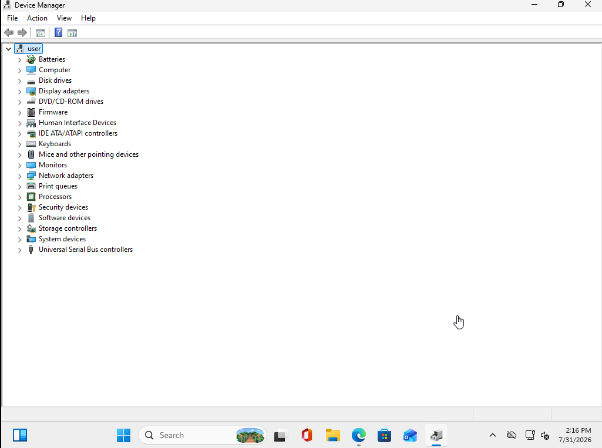
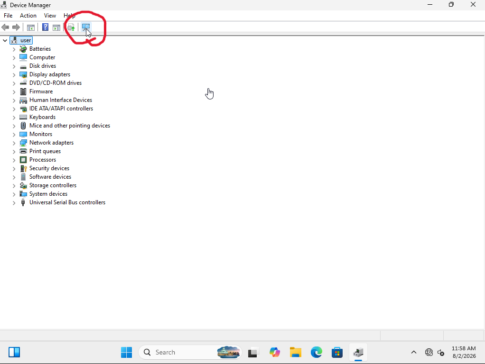
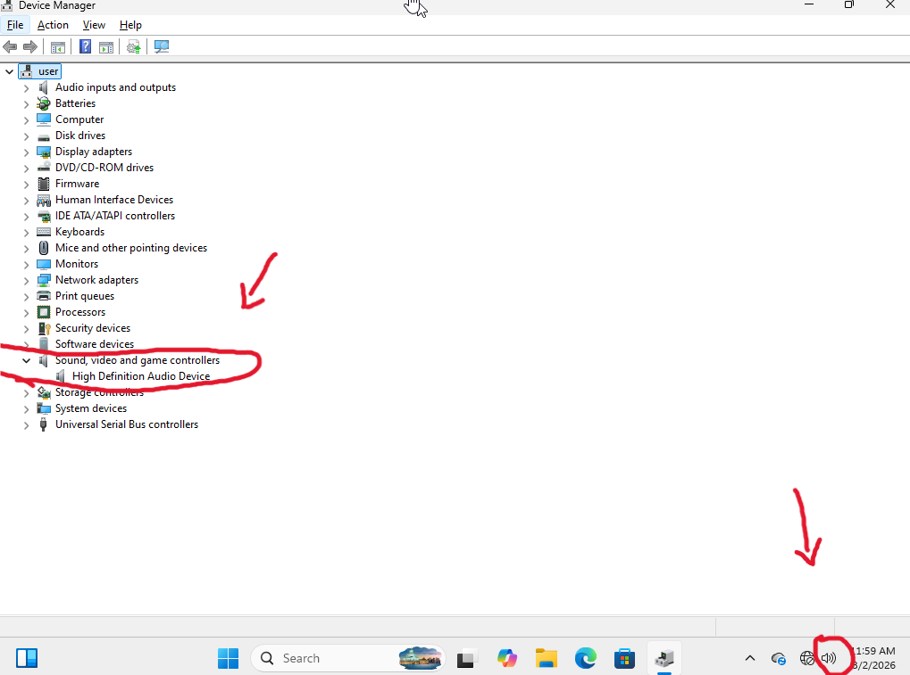

# Incident Report

## No Audio
**Incident #:** 02

**Date:** 5/30/2026

**System/Device:** Windows 11 Pro Virtual Machine (Domain-Joined Client)

**Severity:** Low

---

# 1. Incident Summary

**Issue Reported:**

The user reported that no audio was played when attempting to play multimedia files, despite the system appearing to function normally.

---

# 2. Symptoms

Symptoms observed:

- No audio was produced through the system speakers.
- The speaker icon displayed an "X" in the Windows taskbar, indicating that no audio output device was available.

---

# 3. Environment Details

**Operating System:** Windows 11 Pro

**Device Type:** VMware Virtual Machine

**Network Configuration:** Connected to Active Directory environment

**Domain/Workgroup:** nelcorp.local

---

# 4. Initial Assessment

Initial checks performed:

- Verified that the workstation could not produce audio by playing a video.
- Verified that the volume levels were not muted using the Volume Mixer.
- Verified whether Windows recognized the installed audio device in Device Manager.

---

# 5. Troubleshooting Steps

## Step 1

**Action Performed:**

Checked whether Windows detected the audio device in Device Manager.

**Tool Used:**

Device Manager

**Result:**

No audio device was listed under **Sound, video and game controllers**.

**Finding:**

The missing device suggested that Windows was unable to detect the audio hardware or that the required driver was unavailable.

---

## Step 2

**Action Performed:**

Performed a hardware scan in Device Manager to detect missing devices and reinstall the appropriate driver.

**Tool Used:**

Device Manager

**Result:**

Windows successfully detected the audio device and automatically reinstalled the required driver.

**Finding:**

The missing audio device was restored after the hardware scan, indicating that Windows was able to detect the hardware and reload the driver.

---

## Step 3

**Action Performed:**

Verified audio functionality by playing a video.

**Tool Used:**

YouTube (Web Browser)

**Result:**

Audio playback was successful, and the "X" icon was no longer displayed on the taskbar.

---

# 6. Root Cause

Windows was unable to detect the installed audio device until a hardware scan was performed, preventing the operating system from loading the required audio driver.

---

# 7. Resolution

Steps performed:

- Verified that the issue was not caused by the system volume.
- Checked whether the audio device was detected in Device Manager.
- Performed a hardware scan using Device Manager.
- Confirmed that Windows automatically reinstalled the required audio driver.
- Verified successful audio playback.

---

# 8. Verification

Tests performed:

- Verified that the audio device appeared correctly in Device Manager.
- Played a video to confirm audio playback.
- Confirmed that the speaker icon no longer displayed an "X".

---

# 9. Screenshots / Evidence

## 1. Initial Issue

The user reported that no audio was being played through the workstation speakers.

---

## 2. Investigation

Opened **Device Manager** to inspect the status of the audio device and verify whether a driver issue was present.

---

## 3. Resolution

Performed a hardware scan, allowing Windows to detect the audio device and automatically reinstall the required driver.

---

## 4. Verification

Confirmed that the audio device was functioning properly in **Device Manager** and that the speaker icon no longer displayed any issues.

---

# 10. Lessons Learned

This incident demonstrated the importance of verifying hardware detection and driver availability when troubleshooting audio issues. Device Manager is a valuable tool for identifying missing or malfunctioning devices, and performing a hardware scan can restore functionality when Windows fails to detect a device.
