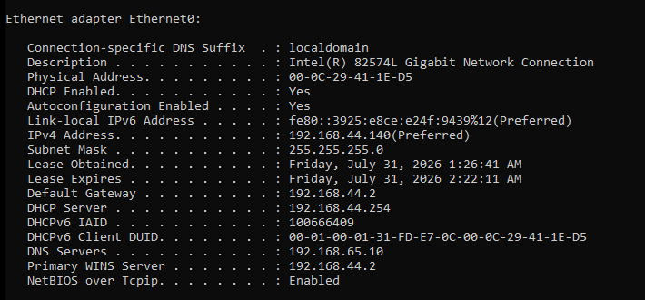
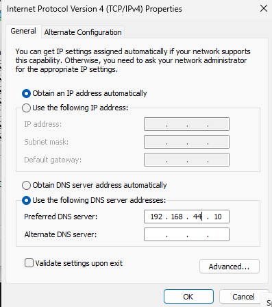
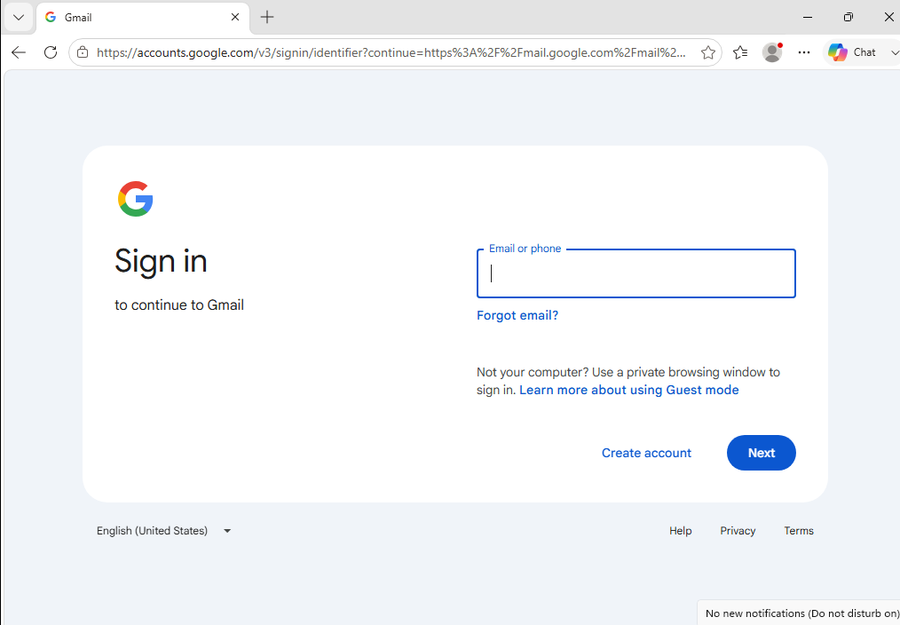

# Incident Report

## Network Problem
**Incident #:**  01

**Date:** 5/25/2026 

**System/Device:** Windows 11 Pro Virtual Machine (Domain-Joined Client) 

**Severity:** Medium

---

# 1. Incident Summary

**Issue Reported:**

Describe the problem from the user's perspective.

Example:
> The user reported that they couldn't access websites from their workstation 

---

# 2. Symptoms

Symptoms observed:

- The computer wouldn't charge any website
- After failing to charge the website it would show an error "{website domain}'s IP Address could be not found"

---

# 3. Environment Details

**Operating System:** Windows 11 Pro 

**Device Type:** VMware Virtual Machine 

**Network Configuration:**  Connected to Active Directory environment

**Domain/Workgroup:** nelcorp.local


---

# 4. Initial Assessment

Initial checks performed::

- Verified that the Windows 11 client VM was powered on and connected to the network.
- Confirmed that the issue was only affecting this workstation.
- Checked the network adapter status and confirmed it was enabled.
- Tested network connectivity with the ping command.
- Tested network connectivity with the nslookup command and realized it was a problem with the DNS server. 

---

# 5. Troubleshooting Steps

## Step 1: 

**Action Performed:**

Ping google.com and used nslookup command to test connectivity

**Command Used:**

```cmd
ping google.com
nslookup google.com
```
**Result:**

When I used the ping command i coundn't communicate with google.com resulting in a 100% loss, and when using nslooup I kept receiving messages saying DNS request timed out.

**Finding:**

Even though we couldn't communicate by using the pinging command it might be just a DNS misconfiguration. However more tests have to be used to actually know what issue we are dealing with.

## Step 2: 

**Action Performed:**

Reviewed the workstation's IP configuration to verify the IP address, default gateway, and DNS settings.

**Command Used:**

```cmd
ipconfig /all
```
**Result:**

All the workstation network configuration was correct except the DNS server IP which should've been 192.168.44.10 and instead was set to 192.168.65.10

**Finding:**

The problem might be a DNS server error rather than a connection error


## Step 3: 

**Action Performed:**

Ping the server IP (192.168.44.10) and the Google Public DNS ip (8.8.8.8)

**Command Used:**

```cmd
ping 192.168.44.10
ping 8.8.8.8
```
**Result:**

The tests of network connectivity to both IPs was a success

**Finding:**

In fact the problem was the incorrect settings in the DNS server IP address.

## Step 4: 

**Action Performed:**

Updated Network configuration for the preferred DNS address to point to the server's address

**Tool Used:**

Network adapter properties window

**Result:**

The workstation was now able to communicate with the right DNS IP address 

## Step 5: 

**Action Performed:**

Tested that everything was working normally by accesing a website in the browser and pinging google.com again

**Tool Used:**

Internet Browser and command Prompt

**Command used:**

```cmd
ping google.com
```
**Result:**

Both tests were a success.

# 6. Root Cause

The problem was caused by a DNS misconfiguration, because of it the workstation couldn't communicate with the DNS server which make impossible to access websites or services by their domain name.

# 7. Resolution

Steps performed:
- Tested the network to see if it was a connectivity problem or just a DNS misconfiguration.
- Reviewed the Network setting to see if there was a misconfiguration.
- Corrected the DNS misconfiguration.
- Tested DNS resolution and internet connectivity.

# 8. Verification

Tests performed:
- Tested connectivity by using the ping command to ping google.com
- Tested connectivity again by accessing a website in the internet browser

# 9. Screenshots / Evidence
## 1. Initial Issue
The user was unable to access websites due to a network connectivity issue.


---

## 2. Initial Investigation
Verified the workstation's network configuration and connectivity using Command Prompt.


---

## 3. Root Cause Evidence
Identified that the workstation was configured with an incorrect DNS server.



---

## 4. Resolution
Updated the DNS configuration to use the correct DNS server.



---

## 5. Browser Verification
Confirmed that websites loaded successfully after applying the fix.



---

## 6. Command-Line Verification
Verified successful DNS resolution and network connectivity using Command Prompt.


# 10. Lessons Learned

This incident shows how important the DNS server is, specially in an Active Directory environment. It also showed how a small misconfiguration can ruin everything.


