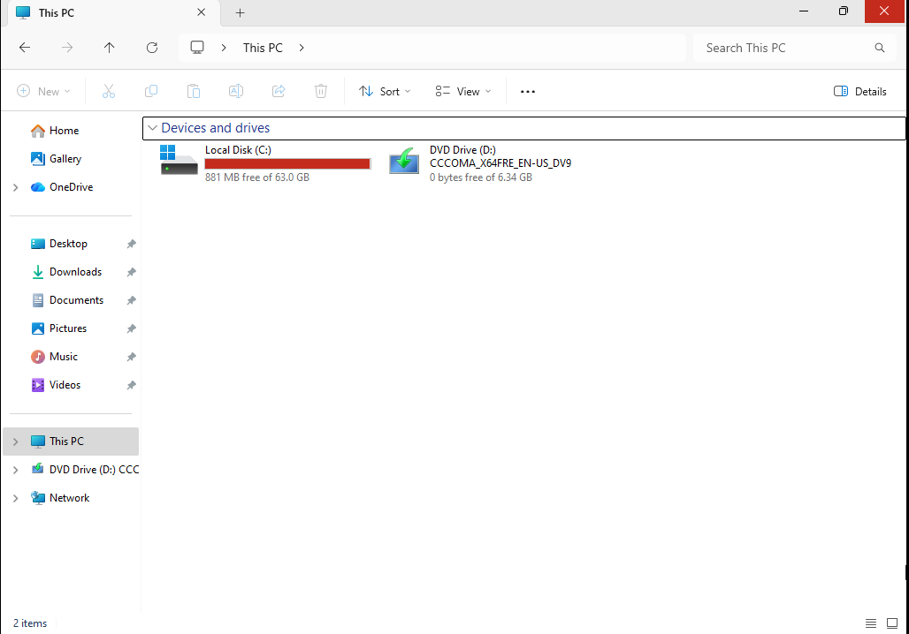
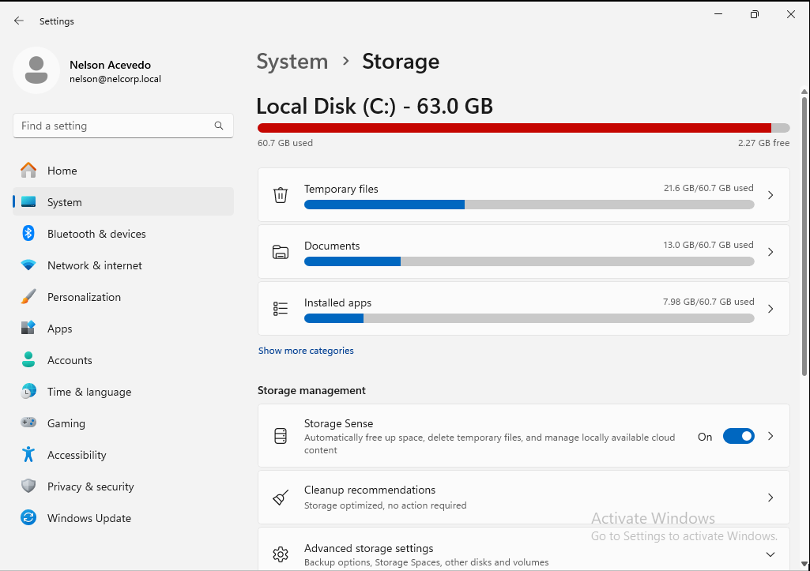
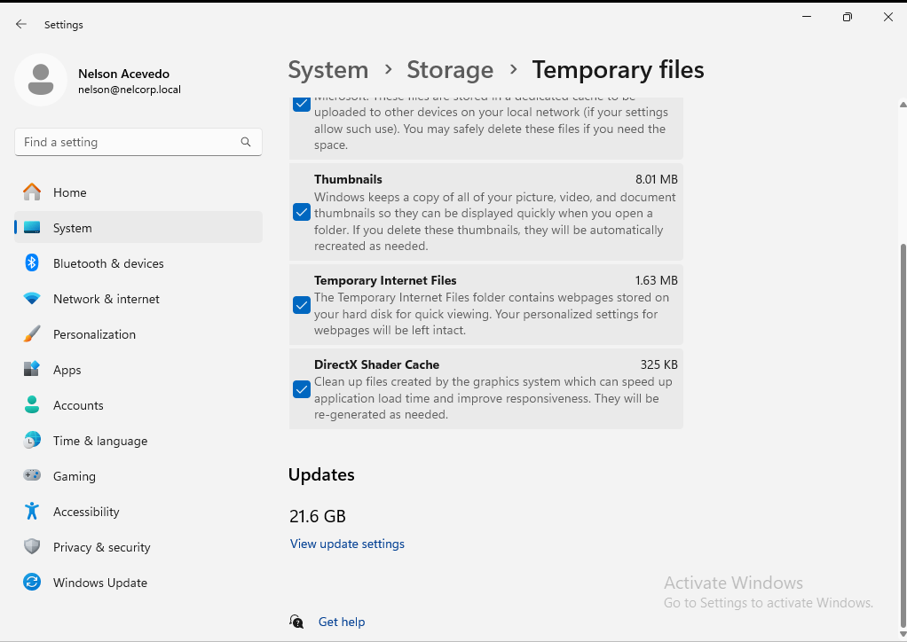
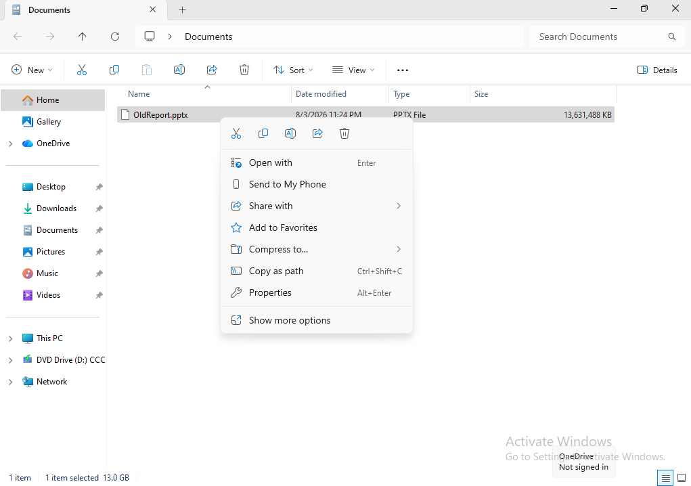
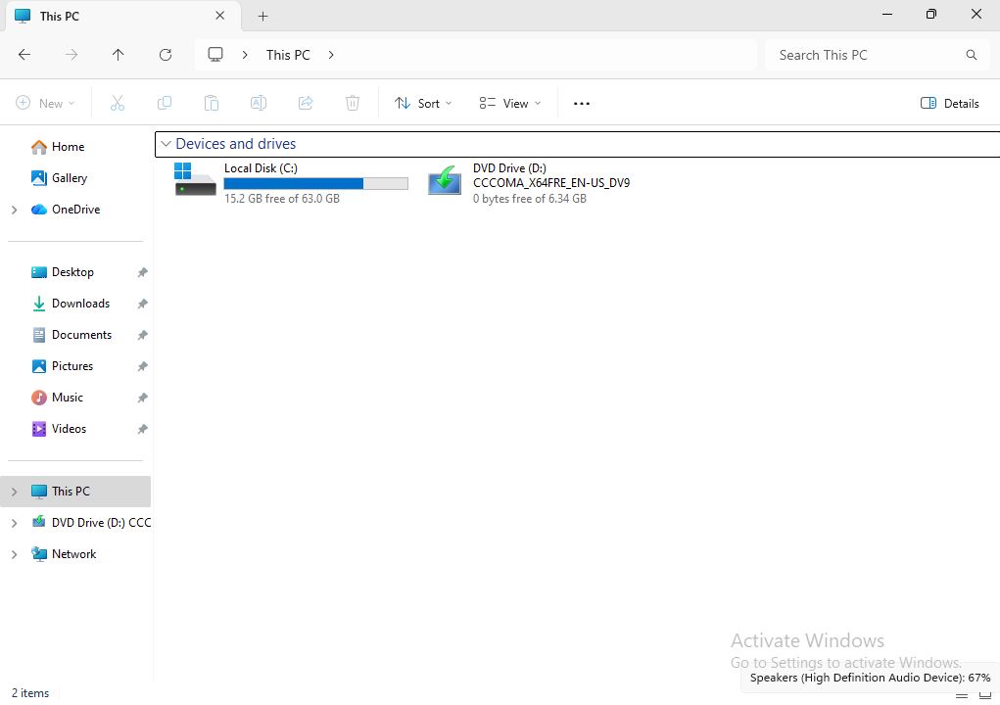

# Incident Report

## Low Disk Space Preventing Software Installation

**Incident #:** 04

**Date:** 6/25/2026

**System/Device:** Windows 11 Pro Virtual Machine (Domain-Joined Client)

**Severity:** Medium

---

# 1. Incident Summary

**Issue Reported:**

The user reported being unable to install new software because the workstation was running low on available disk space.

---

# 2. Symptoms

Symptoms observed:

- The user was unable to install new software.
- Windows reported that the local disk (C:) was running low on available storage.
- The workstation had very little free disk space remaining.

---

# 3. Environment Details

**Operating System:** Windows 11 Pro

**Device Type:** VMware Virtual Machine

**Network Configuration:** Domain-joined Windows 11 VM connected to an Active Directory environment.

**Domain/Workgroup:** nelcorp.local

---

# 4. Initial Assessment

Initial checks performed:

- Verified that the local disk (C:) was nearly full.
- Confirmed that the issue was related to low disk space rather than an application installation error.
- Began investigating which files and folders were consuming the most storage.

---

# 5. Troubleshooting Steps

## Step 1

**Action Performed:**

Checked the available free space on the local disk (C:).

**Tool Used:**

File Explorer

**Result:**

The C: drive had very little free storage remaining.

**Finding:**

The issue was confirmed to be related to insufficient disk space.

---

## Step 2

**Action Performed:**

Performed a storage analysis using Windows Storage Settings to identify which categories were consuming the most disk space.

**Tool Used:**

Windows Storage Settings

**Result:**

Windows Storage identified **Temporary Files** and **Documents** as the largest contributors to disk usage.

**Finding:**

Most of the temporary storage was occupied by Windows Update files. After excluding temporary files, the Documents folder remained the largest user-created source of disk usage.

---

## Step 3

**Action Performed:**

Reviewed the Documents folder to identify large or unnecessary files.

**Tool Used:**

File Explorer

**Result:**

A large PowerPoint presentation was identified as consuming a significant amount of storage.

**Finding:**

After confirming with the user, it was determined that the presentation was no longer needed and could be safely removed.

---

## Step 4

**Action Performed:**

Deleted the unnecessary PowerPoint presentation and emptied the Recycle Bin to permanently remove the file.

**Tool Used:**

File Explorer

**Result:**

The file was permanently removed from the workstation.

---

## Step 5

**Action Performed:**

Verified the available storage after deleting the file.

**Tool Used:**

File Explorer

**Result:**

Free disk space increased significantly, and sufficient storage was available for new software installations.

---

# 6. Root Cause

The workstation contained a large PowerPoint presentation that was no longer needed. The unnecessary file consumed a significant portion of the available disk space, preventing the installation of additional software.

---

# 7. Resolution

Steps performed:

- Used Windows Storage Settings to identify large files and folders.
- Confirmed that the PowerPoint presentation was no longer required.
- Deleted the unnecessary file.
- Emptied the Recycle Bin to permanently free disk space.
- Verified that sufficient storage had been restored.

---

# 8. Verification

Tests performed:

- Verified that free disk space increased after deleting the file.
- Confirmed that new software could be installed successfully.
- Verified normal disk operation.

---

# 9. Screenshots / Evidence

## 1. Initial Investigation

Reviewed the available storage on the local disk (C:) using File Explorer and confirmed that the drive was nearly full.

---

## 2. Storage Analysis

Used **Windows Storage Settings** to identify which storage categories were consuming the most disk space.

---

## 3. Root Cause Evidence

Reviewed the storage breakdown and determined that Windows Update files and the **Documents** folder were the primary contributors to disk usage. After excluding temporary system files, the Documents folder was identified as containing the largest user-created file.

---

## 4. Resolution

Deleted the unnecessary PowerPoint presentation and permanently removed it from the Recycle Bin to free disk space.

---

## 5. Verification

Verified that the available storage on the local disk (C:) had increased after deleting the unnecessary file.

---

# 10. Lessons Learned

This incident demonstrated the importance of regularly monitoring available disk space and using Windows Storage tools to identify large or unnecessary files. Performing routine storage maintenance can help prevent software installation failures and other issues caused by insufficient disk space.
