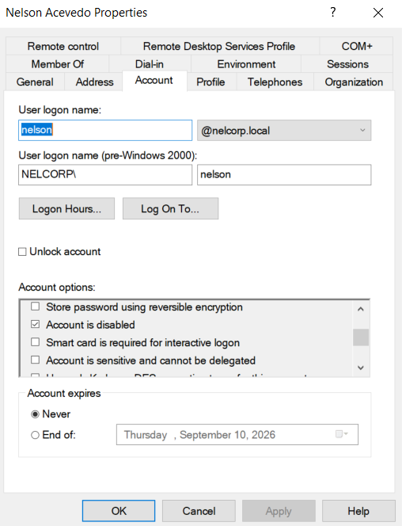
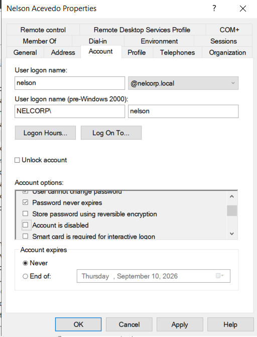
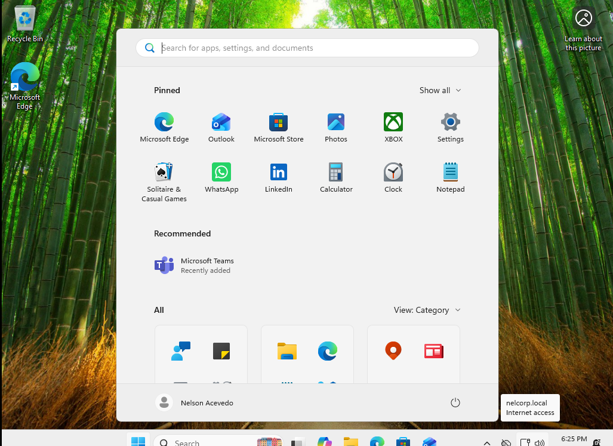

# Incident Report

## Domain User Unable to Log In Due to Disabled Account

**Incident #:** 04

**Date:** 6/29/2026

**System/Device:** Windows 11 Pro Virtual Machine (Domain-Joined Client)

**Severity:** Medium

---

# 1. Incident Summary

**Issue Reported:**

The user reported being unable to log in to their workstation and receiving a message indicating that their account was disabled.

---

# 2. Symptoms

Symptoms observed:

- The user was unable to log in to the workstation.
- The user received a message indicating that their account was disabled.

---

# 3. Environment Details

**Operating System:** Windows 11 Pro

**Device Type:** VMware Virtual Machine

**Network Configuration:** Domain-joined Windows 11 VM connected to an Active Directory environment.

**Domain/Workgroup:** nelcorp.local

**Authentication:** Domain account authenticated through Active Directory

---

# 4. Initial Assessment

Initial checks performed:

- Verified that the workstation was joined to the correct Windows domain.
- Confirmed that the user was attempting to log in with the correct domain credentials.
- Checked Windows Event Viewer on the Domain Controller to determine whether the failed authentication attempt was recorded in the Security logs.
- Investigated the user's account status in Active Directory.

---

# 5. Troubleshooting Steps

## Step 1

**Action Performed:**

Checked the user's account status on the Domain Controller to determine whether the account was disabled.

**Tool Used:**

Active Directory Users and Computers

**Result:**

The **"Account is disabled"** option was enabled in the user's account properties.

**Finding:**

The user's inability to log in was caused by the Active Directory account being disabled.

---

## Step 2

**Action Performed:**

Re-enabled the user's account by unchecking the **"Account is disabled"** option under the account settings.

**Tool Used:**

Active Directory Users and Computers

**Result:**

The user's account was no longer marked as disabled.

---

## Step 3

**Action Performed:**

Tested whether the user could successfully log in to the Windows 11 workstation after the account was re-enabled in Active Directory.

**Tool Used:**

Windows 11 Login Screen

**Result:**

The user was able to log in successfully using their domain credentials.

**Finding:**

The issue was caused by the user's Active Directory account being disabled. The cause of the account being disabled was not determined.

---

# 6. Root Cause

The user's Active Directory account was disabled, preventing the user from authenticating and accessing the Windows 11 workstation. The cause of the account being disabled was not determined.

---

# 7. Resolution

Steps performed:

- Verified that the user's Active Directory account was disabled.
- Re-enabled the account using Active Directory Users and Computers.
- Confirmed that the account was no longer marked as disabled.
- Retested authentication from the Windows 11 workstation.

---

# 8. Verification

Tests performed:

- Confirmed that the user could successfully log in using their domain credentials.
- Confirmed that the Windows 11 desktop loaded normally.
- Verified that the user's account was enabled in Active Directory.

---

# 9. Screenshots / Evidence

## 1. Initial Issue

The user was unable to log in to the Windows 11 workstation and received a message indicating that the account was disabled.

---

## 2. Investigation

Checked the user's account in **Active Directory Users and Computers** to investigate the cause of the authentication failure.

---

## 3. Resolution

Confirmed that the **"Account is disabled"** option was enabled and re-enabled the user's account by unchecking the option.

---

## 4. Verification

Tested the user's domain credentials again after re-enabling the account and confirmed that the user was able to log in successfully.

---

# 10. Lessons Learned

This incident demonstrated the importance of properly managing Active Directory user accounts and checking account status when troubleshooting authentication problems. It also showed how Active Directory Users and Computers can be used to quickly identify and resolve disabled-account issues.
